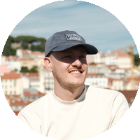
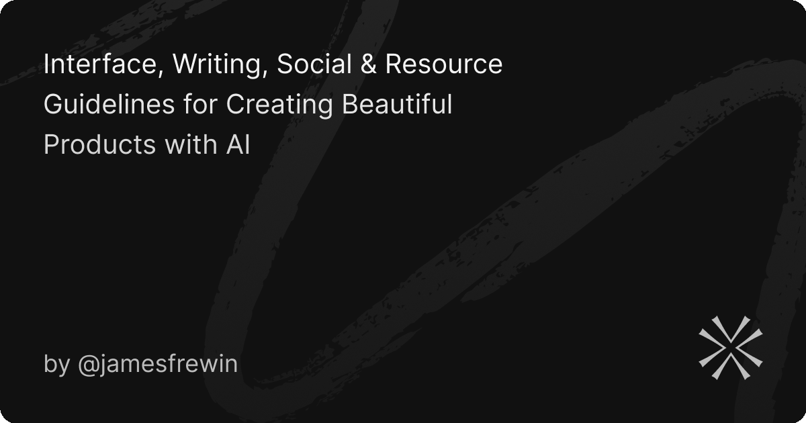

<p align="center">
  
</p>

<h1 align="center">Hey, I'm James 👋</h1>

<p align="center">
  <strong>Design Engineer & Photographer</strong> · British designer living in Lisbon, Portugal.
</p>

<p align="center">
  <a href="https://www.jamesfrewin.com">Website</a> · 
  <a href="https://x.com/james_frewin">X</a> · 
  <a href="https://www.linkedin.com/in/jamesfrewin">LinkedIn</a>
</p>

<br>

I run [OCTOBER](https://october.studio), an independent design studio for startups and VCs. We ship products people actually want to use.

<br>

## What I Build

```
Web Apps · React Native Apps · SwiftUI for iOS & Mac · Chrome Extensions · Landing Pages & Funnels
```

11 years in Product Design, Brand and Marketing. Through the studio, I've led UI/UX and brand for VC funds, AI startups, fintech, beauty tech, consumer apps and B2B SaaS.

<br>

## Clients

<table>
  <tr>
    <td><a href="https://linkedin.com">LinkedIn</a></td>
    <td><a href="https://unilever.com">Unilever</a></td>
    <td><a href="https://gov.uk">UK Government</a></td>
    <td>UAE Government</td>
    <td><a href="https://atlanticrecords.com">Atlantic Records</a></td>
  </tr>
  <tr>
    <td><a href="https://k5global.com">K5 Global</a></td>
    <td><a href="https://backed.vc">Backed VC</a></td>
    <td>Circle Rock Capital</td>
    <td><a href="https://landscape.vc">Landscape</a></td>
    <td><a href="https://amy.vc">Amy.vc</a></td>
  </tr>
  <tr>
    <td><a href="https://autogenai.com">AutogenAI</a></td>
    <td><a href="https://proper.ai">Proper</a></td>
    <td><a href="https://versantus.co.uk">Versantus</a></td>
    <td><a href="https://foster.co">Foster</a></td>
    <td><a href="https://thingtesting.com">Thingtesting</a></td>
  </tr>
  <tr>
    <td><a href="https://every.to">Every</a></td>
    <td>Altbank</td>
    <td><a href="https://outverse.com">Outverse</a></td>
    <td><a href="https://mvpr.io">MVPR</a></td>
    <td><a href="https://imageninsights.com">Imagen Insights</a></td>
  </tr>
  <tr>
    <td>Rollups</td>
    <td>Jack and Jill</td>
    <td>Otel</td>
    <td><a href="https://beautystack.com">Beautystack</a></td>
    <td>TRIM-IT</td>
  </tr>
</table>

<br>

## Building with AI

One of [Cursor](https://www.cursor.com)'s first Ambassadors, helping designers and founders build production apps with AI.

<a href="https://guidelines.sh">
  
</a>

| Project | Description |
|---------|-------------|
| [buildwithaicourse.com](https://www.buildwithaicourse.com) | Teaching designers and founders to build with AI |
| [guidelines.sh](https://guidelines.sh) | A guide to making AI-built products feel less AI |
| [NoReply](https://noreply.so) | Currently building |

<br>

## VC Scout

I meet early-stage founders and help them shape product, brand and pitch before they raise.

<br>

## Speaking & Teaching

<details>
<summary>View institutions</summary>
<br>

- LinkedIn
- EY
- BT
- Kings College London
- London Business School
- Dubai 10X
- National Film And Television School
- Coventry University
- University of Gloucestershire

</details>

<br>

## Photography

Outside of the screen, I love capturing people, architecture, nature and cars. Over **7.4 million views** on my photos.

<br>

## Featured In

> The Telegraph · BuzzFeed News · Evening Standard · Backed VC · Huckletree

<br>

## Beyond Work

Leeds United fan · Learning Portuguese · Making the most of Lisbon sunshine ☀️

<br>

## Let's Connect

I work best with forward-thinking teams building at the edge of what's possible. People who care deeply about craft and aren't afraid to move fast.

[](https://www.jamesfrewin.com)
[](https://x.com/james_frewin)
[](https://www.linkedin.com/in/jamesfrewin)
